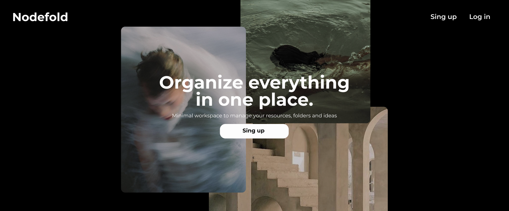
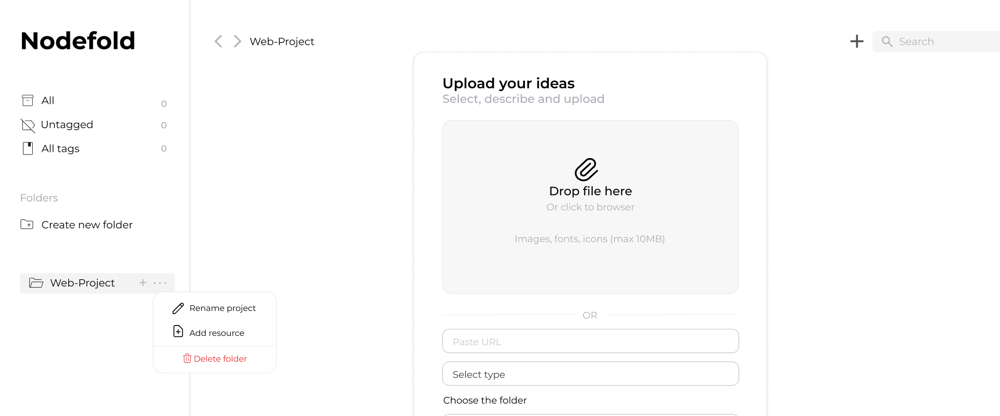
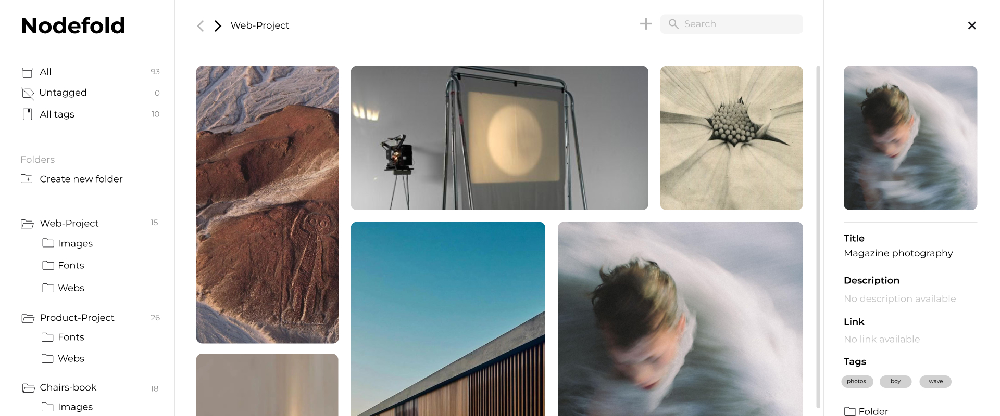
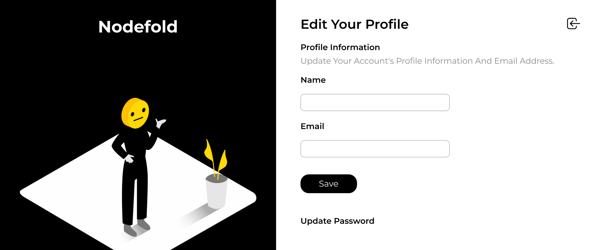

<p align="center">
  
</p>

## About

**Nodefold** is a minimal workspace designed to help you save and organize resources for your creative projects. From images and icons to fonts and web inspiration, it provides a dedicated space to store, structure, and keep track of the tools that spark your ideas, whether for immediate use or future reference.

Built around the idea that every resource deserves its own folder, Nodefold allows you to create custom collections and organize everything in a way that fits your workflow.

## 💻 Technologies Used

- **Backend:** PHP (>=8.1), Laravel, Livewire
- **Frontend:** Blade, Alpine.js, HTML5, Tailwind CSS
- **Database:** MySQL
- **Environment:** XAMPP

## Features

### Authentication

- Create an account and/or log in
- Reset password

### Dashboard

- Create parent folders and subfolders
- Edit or delete folders
- Add new resources (Images, Fonts, Websites, Color Palettes, Icons)
- Set a name, description, URL, and tags for each resource
- Click on a resource to view and edit its details
- Move between folders
- Search resources by name or tag
- Filter resources by tag, untagged, or view all

### User Profile

- Update personal information
- Change password
- Delete account

### Additional

- Custom 404 error page

<p align="center">
  
  
</p>

<p align="center">
  
  
</p>

## How It Works

Nodefold allows you to save and organize different types of creative resources.  
Each resource type works slightly differently:

---

### 🖼 Images

Upload images directly from your device.  
The file will be stored locally and displayed inside your selected folder.

---

### 🔤 Fonts

To save a font, copy the font URL from:

https://fonts.google.com

Paste the link into the font input field and Nodefold will store it as a reference resource.

---

### 🎨 Color Palettes

This feature integrates with:

https://coolors.co

Simply copy the URL of a color palette and paste it into the input field.  
Nodefold will store the palette and automatically extract and display the HEX color codes.

---

### 🌐 Websites

To save a website, paste its URL into the web input field.

---

### ⭐ Icons

To save icons, copy the CDN URL from:

https://allsvgicons.com/

Paste it into the input field, and Nodefold will store it as an external icon resource.

## 🚧 Current Limitations

At the moment, Fonts, Color Palettes, and Icons depend directly on specific external sources (Google Fonts, Coolors, and AllSVGIcons).

Future improvements aim to:

- Support additional providers
- Allow manual HEX input for palettes
- Enable direct SVG uploads for icons

---

### 🛠️ Setup & Installation

### Prerequisites

Make sure your local development environment is running.  
If you're using **XAMPP**, start both **Apache** and **MySQL** services before proceeding.

### Clone the repository

```bash
git clone https://github.com/miguelm-montano/Nodefold.git
cd Nodefold
```

## Install dependencies

```bash
composer install
npm install
```

## Configure environment

Create your environment file and generate the application key:

```bash
cp .env.example .env
php artisan key:generate
```

## Create the symbolic link for storage

This command creates a symbolic link between the storage folder and the public directory, allowing uploaded files to be publicly accessible:

```bash
php artisan storage:link
```

## Create the database

Create a database named **mood_vault** then update your **.env** file with your database credentials:

```bash
DB_CONNECTION=mysql
DB_HOST=127.0.0.1
DB_PORT=3306
DB_DATABASE=mood_vault
DB_USERNAME=root
DB_PASSWORD=
```

## Run migrations

```bash
php artisan migrate
```

## Start the development servers

In the first terminal:

```bash
npm run dev
```

In a second terminal:

```bash
php artisan serve
```

Then open: [http://127.0.0.1:8000](http://127.0.0.1:8000)

## Custom 404 Page

To view the custom 404 page:

```bash
Set APP_DEBUG=false in your .env file.

Navigate to any non-existent route, for example:
http://127.0.0.1:8000/non-existent-page

After testing, set APP_DEBUG=true again for normal development.
```

## 📨 Mail & Password Reset

Password reset and email verification are powered by Laravel Breeze.
For local development, emails are configured in log mode:

```bash
MAIL_MAILER=log
```

Instead of sending real emails, the reset password link will be stored in:

```bash
storage/logs/laravel.log
```

## ⚠️ Troubleshooting

If you experience unexpected behavior (routes not updating, configuration changes not applying, views not refreshing, etc.), try clearing the application cache:

```bash
php artisan view:clear
php artisan cache:clear
php artisan config:clear
php artisan route:clear
```

## Project Branches

At the moment, the project contains two main branches:

### `develop`

This branch implements the core functionality using Alpine.js for frontend interactions.

While fully functional, some actions (such as creating folders or updating resources) may cause small page refreshes or brief visual jumps due to the traditional request-response cycle.

---

### `develop-livewire`

This branch enhances the user experience by integrating Laravel Livewire.

By using Livewire, many interactions (e.g., creating folders, updating content) are handled dynamically without full page reloads, resulting in smoother transitions and a more reactive interface.

The **develop-livewire** branch represents the direction of the project moving forward.
